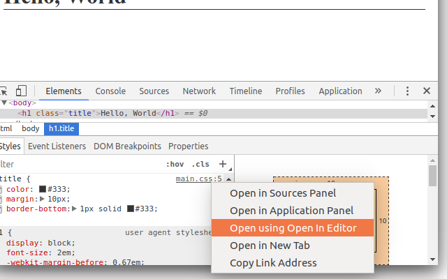

# open-in-editor-extension

This Chrome Developer Tools Extension is a companion of the [open-in-editor-connect] middleware. It adds an ability to open local files in an external editor from the Chrome DevTools context menus.

Look at the [open-in-editor-connect] documentation for more details.

## License

[MIT](LICENSE)

## For more information

-   Connect/Express middleware for Node.Js [open-in-editor-connect]
-   Powered by [open-in-editor]

**Enjoy!**

[open-in-editor]: https://github.com/lahmatiy/open-in-editor
[open-in-editor-connect]: https://npmjs.com/package/open-in-editor-connect